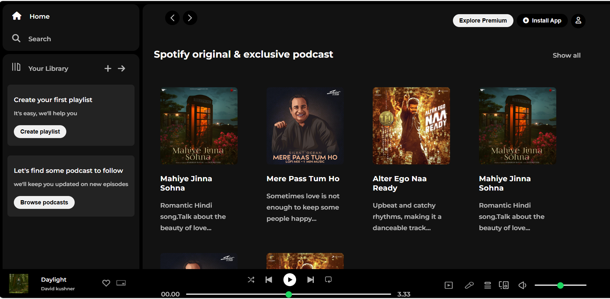

# 🎧 Spotify Clone (HTML + CSS)

A front-end clone of **Spotify**, built entirely using **HTML and CSS**.  
This project replicates the look and feel of Spotify’s user interface — including the sidebar, playlist section, player controls, and album cards — using only pure CSS and no JavaScript.

---

## 🚀 Features

- 🎵 Beautiful Spotify-inspired UI   
- 🎚️ Interactive hover effects and transitions  
- 🖤 Spotify color theme  
- 🧭 Well-structured and semantic HTML  
- 💻 Works on all major browsers

---

## 🛠️ Technologies Used

- **HTML5**  
- **CSS3 (Flexbox + Grid + Transitions)**  
- **Google Fonts / Font Awesome (for icons)**

---

## 📸 Preview

Live Link : https://spotify-clone-front-page.netlify.app/

